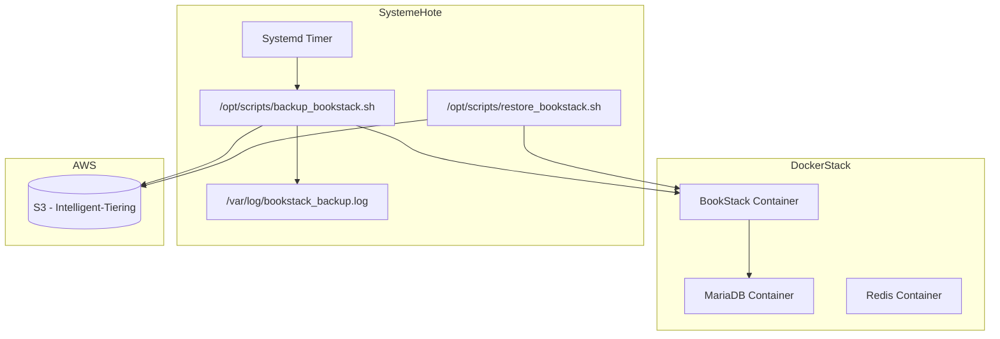

---

# 📘 Documentation Technique – Sauvegarde & Restauration BookStack vers AWS S3

## 📌 Objectif

Mettre en place une sauvegarde régulière et automatisée de la base de données `BookStack` (MariaDB) vers un bucket AWS S3 en **classe Intelligent-Tiering**, avec :

* Script de sauvegarde robuste (`backup_bookstack.sh`)
* Script de restauration sécurisé (`restore_bookstack.sh`)
* Exécution automatique via `systemd --user`
* Journalisation et contrôle d’erreur
* Préparation pour évolutions futures (Glacier, GitOps, monitoring)

---

## 🧱 Architecture Résumée (Mermaid)




---

## ⚙️ Configuration en place

### 🔹 Stack Docker Compose

* `bookstack` avec `linuxserver/bookstack` (Traefik, .env.docker injecté)
* `mariadb` avec mot de passe complexe
* `redis` actif pour cache/session
* Volumes persistants
* `.env.docker` contenant : `DB_*`, `REDIS_*`, `APP_KEY`, etc.

### 🔹 Script de sauvegarde `/opt/scripts/backup_bookstack.sh`

Contenu simplifié :

```bash
#!/bin/bash
# Dump DB depuis container, en utilisant les variables d’env Docker
# Upload vers S3 (Intelligent-Tiering), log & clean

...
docker exec "$CONTAINER_NAME" sh -c 'mariadb-dump -h"$DB_HOST" -u"$DB_USERNAME" -p"$DB_PASSWORD" "$DB_DATABASE"' \
    | gzip > "$TMP_FILE"

aws s3 cp "$TMP_FILE" "s3://$BUCKET_NAME/..." --storage-class INTELLIGENT_TIERING
rm -f "$TMP_FILE"
```

Journalisation : `/var/log/bookstack_backup.log`

Protection : `chmod 750`, exécution par user non-root via `systemd --user`

### 🔹 Script de restauration `/opt/scripts/restore_bookstack.sh`

Contenu :

```bash
aws s3 cp "s3://$BUCKET_NAME/$BACKUP_NAME" "$TMP_FILE"
# Affiche les tables existantes
docker exec "$CONTAINER_NAME" sh -c 'mariadb -e "SHOW TABLES;" -u"$DB_USERNAME" -p"$DB_PASSWORD" "$DB_DATABASE"'
# Demande confirmation et restauration depuis gzip
gunzip -c "$TMP_FILE" | docker exec -i "$CONTAINER_NAME" ...
```

Permet de restaurer à partir de n’importe quel backup S3.

---

## 🕒 Automatisation `systemd --user`

### Fichier Timer `~/.config/systemd/bookstack-backup.timer`

```ini
[Unit]
Description=Timer to backup BookStack

[Timer]
OnCalendar=*-*-* 03:00:00
Persistent=true

[Install]
WantedBy=timers.target
```

### Fichier Service `~/.config/systemd/bookstack-backup.service`

```ini
[Unit]
Description=Backup BookStack database to AWS S3

[Service]
ExecStart=/opt/scripts/backup_bookstack.sh
StandardOutput=append:/var/log/bookstack_backup.log
StandardError=append:/var/log/bookstack_backup.log
```

Activation :

```bash
loginctl enable-linger kairos
systemctl --user daemon-reexec
systemctl --user enable --now bookstack-backup.timer
```

---

## 🔐 Sécurité & IAM

### 👤 Utilisateur IAM : `bookstack-backup-user`

Tu as créé un **utilisateur IAM classique**, avec une **clé d'accès** (Access Key ID & Secret Access Key) utilisée localement par AWS CLI (`aws configure`).

Tu **n'utilises pas IAM Identity Center ni CloudShell**.

### ✅ Politique d'autorisation personnalisée

Tu as associé manuellement une **politique JSON personnalisée** au niveau **de l'utilisateur IAM** (pas via groupe).
Voici la **politique correcte que tu as utilisée** :

```json
{
  "Version": "2012-10-17",
  "Statement": [
    {
      "Sid": "AllowSpecificBucketAccess",
      "Effect": "Allow",
      "Action": [
        "s3:ListBucket"
      ],
      "Resource": "arn:aws:s3:::s3-bookstack-backups"
    },
    {
      "Sid": "AllowObjectsInBucket",
      "Effect": "Allow",
      "Action": [
        "s3:PutObject",
        "s3:GetObject",
        "s3:DeleteObject"
      ],
      "Resource": "arn:aws:s3:::s3-bookstack-backups/*"
    }
  ]
}
```

### 🔒 Sécurité des credentials

* La clé d'accès est stockée dans `~/.aws/credentials` suite à `aws configure`.
* Pas d'accès à la console AWS pour l'utilisateur.
* Pas de permissions S3 globales : **accès uniquement au bucket `s3-bookstack-backups`**.

---

## 🔧 Maintenance

### 🔍 Commandes utiles

```bash
# Lancer manuellement le backup
systemctl --user start bookstack-backup.service
```
```bash
# Vérifier les logs
journalctl --user -u bookstack-backup.service
cat /var/log/bookstack_backup.log
```
```bash
# Lister les backups
aws s3 ls s3://s3-bookstack-backups/
```
```bash
# Restaurer un backup
/opt/scripts/restore_bookstack.sh bookstack-2025-08-03_01-20.sql.gz
```

---

## 📈 Évolutions possibles

| Axe         | Proposition                                                         |
| ----------- | ------------------------------------------------------------------- |
| Monitoring  | Intégration avec Grafana, Prometheus (export logs système, alertes) |
| Alerte      | Script de notification sur Discord en cas d’échec (via webhook)     |
| Archivage   | Backup longue durée sur AWS Glacier (via lifecycle S3)              |
| GitOps      | Dépôt Git privé/public avec versionning des scripts                 |
| Déploiement | Intégration à un pipeline CI/CD ou push Git auto-redeploy           |
| Migration   | Transfert complet de la stack sur AWS EC2 + RDS + EFS à terme       |

---

Souhaites-tu que je génère un fichier `.md` ou `.pdf` à partir de cette documentation pour GitHub ou en local ?
